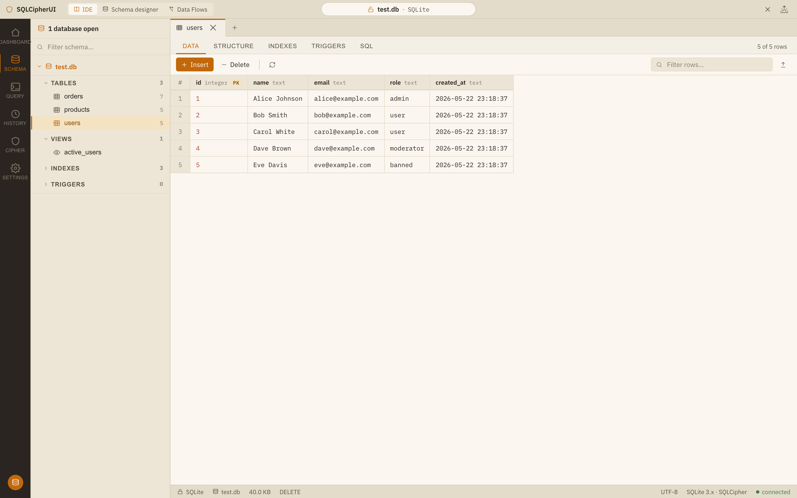
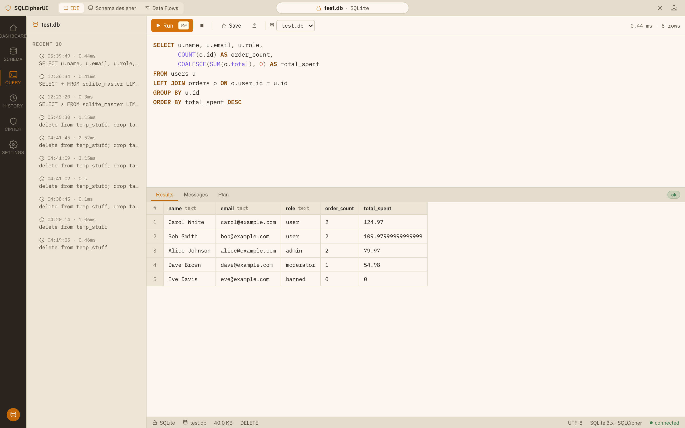
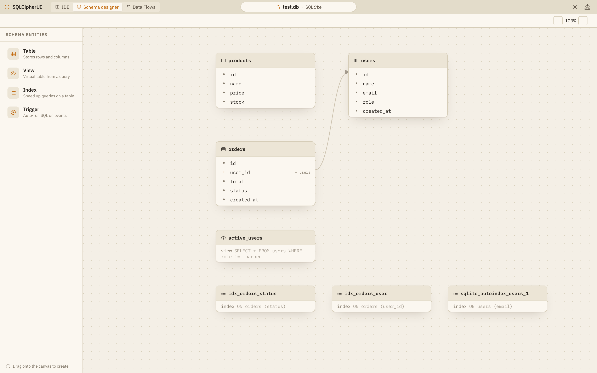
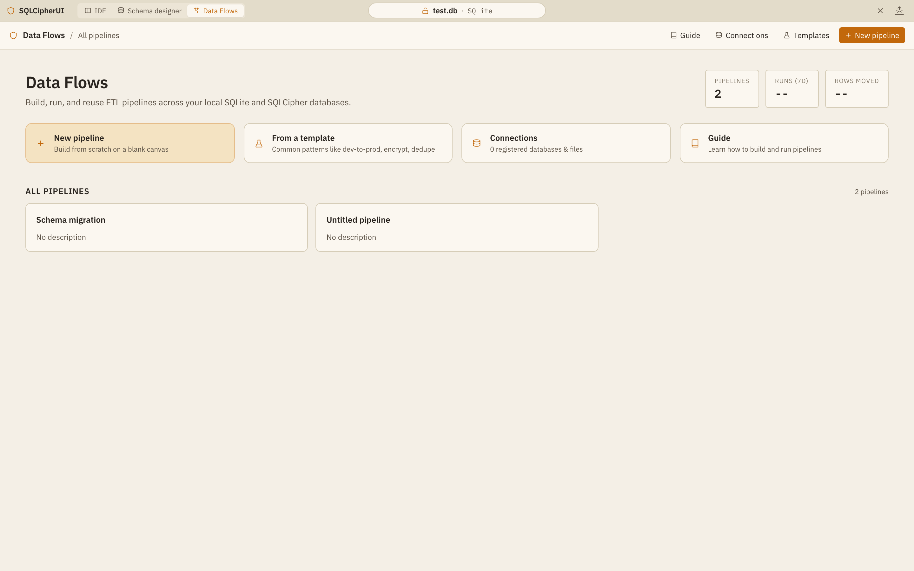
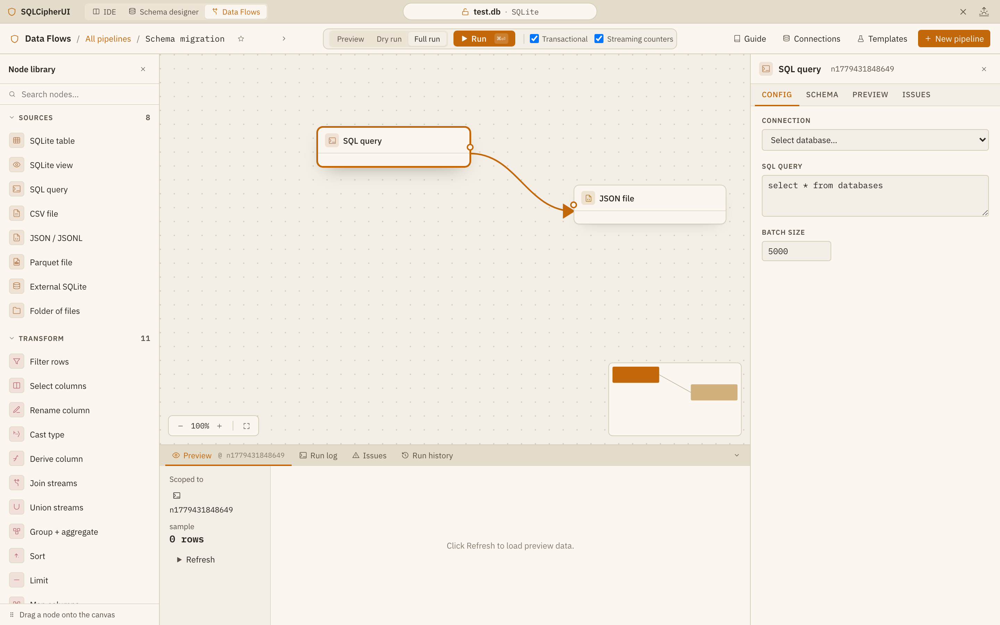

# SQLCipherUI

A local-first database IDE for SQLite and SQLCipher databases. Browse data, write queries, design schemas visually, and build ETL pipelines — all from a single desktop-style interface.

## Features

### IDE Mode

Full-featured database browser with a schema sidebar, tabbed data grid, and SQL query editor.

**Data Browser** — click any table, view, or index in the sidebar to inspect its data, structure, indexes, triggers, and raw SQL definition.



**Query Editor** — write and run SQL with syntax highlighting, query history, execution plans, and tabbed results.



### Schema Designer

Visual ERD canvas that renders every table, view, index, and trigger as a draggable card with foreign-key relationship lines. Add, modify, or remove any schema entity — all changes queue as a pending changeset with a full DDL preview before you publish.

- Add/remove columns with type, NOT NULL, UNIQUE, default value, and foreign key constraints
- Edit views, indexes, and triggers in-place
- FK cascade awareness: deleting a table auto-marks dependent views, indexes, and triggers
- Cancel individual changes or the entire batch



### Data Flows

Visual ETL pipeline builder for moving and transforming data across SQLite and SQLCipher databases. Drag nodes from a 41-type catalog, wire them together, configure transforms, and run pipelines in preview, dry-run, or full mode.

**Pipeline Home** — manage pipelines, connections, and templates from a dashboard with run statistics.



**Pipeline Editor** — node library sidebar, SVG canvas with bezier edges and minimap, per-node config inspector, and a bottom dock with preview data, run log, issues, and history tabs.



## Architecture

Monorepo with three packages:

| Package | Stack | Purpose |
|---------|-------|---------|
| `packages/core` | Python, SQLCipher | Database operations, schema introspection, query execution, pipeline engine |
| `packages/api` | FastAPI | REST + SSE API layer |
| `packages/web` | React, Vite, Zustand | Single-page frontend |

## Getting Started

### Prerequisites

- Python 3.11+
- Node.js 18+
- SQLCipher development libraries (`brew install sqlcipher` on macOS)

### Install

```bash
# Backend
cd packages/core && pip install -e . && cd ../api && pip install -e .

# Frontend
cd packages/web && npm install
```

### Run

```bash
# Start both servers
scripts/devctl start

# Or individually
scripts/apictl start   # API on :8001
scripts/webctl start   # Vite on :5273
```

Open [http://localhost:5273](http://localhost:5273) in your browser.

## License

MIT
